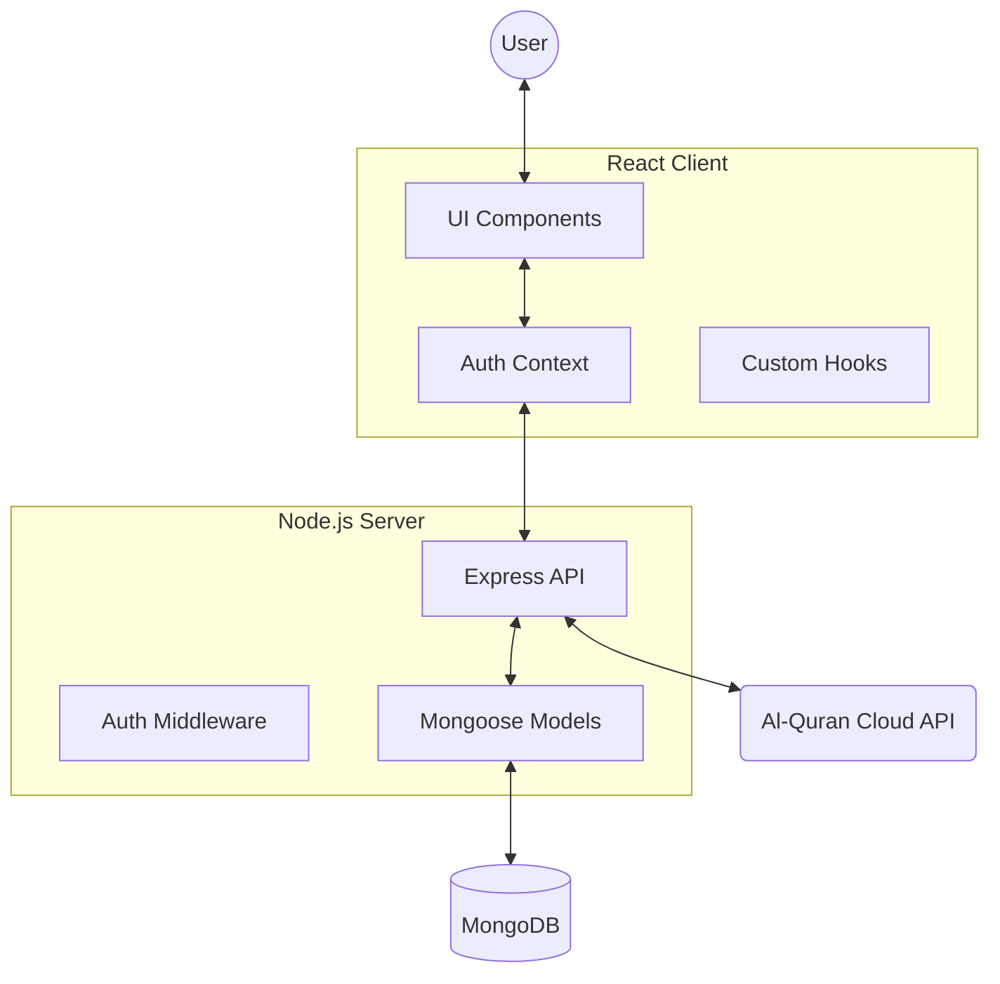

# 🌙 Nur al-Quran (نور القرآن)

**Nur al-Quran** is a modern, full-featured Islamic learning platform designed to provide a spiritual and immersive experience for users to connect with the Holy Quran and other essential Islamic resources.

[](https://reactjs.org/)
[](https://nodejs.org/)
[](https://www.mongodb.com/)
[](https://tailwindcss.com/)

---

## ✨ Key Features

- **📖 Interactive Quran Reader**: Explore all 114 Surahs with a beautiful interface, featuring word-by-word analysis and bookmarking capabilities.
- **🎧 Soul-Stirring Recitations**: Listen to high-quality audio recitations from world-renowned Qaris, synchronized with verse highlighting.
- **🤲 Duas & Azkar**: A comprehensive collection of authentic supplications for daily life, categorized for easy access.
- **🕒 Prayer Times**: Real-time prayer schedules based on location to help you stay connected to your daily worship.
- **✨ 99 Names of Allah**: Deep dive into the beautiful attributes of Allah with meanings and spiritual insights.
- **🔐 User Personalization**: Secure Google Sign-In and local authentication to save bookmarks and track your spiritual progress.
- **📱 Responsive Design**: A "mobile-first" approach ensuring a premium experience across desktops, tablets, and smartphones.

---

## 🛠️ Technology Stack

### Frontend
- **Framework**: React 19 (Vite)
- **Styling**: Tailwind CSS & Vanilla CSS
- **Animations**: Framer Motion
- **Icons**: Lucide React
- **Routing**: React Router DOM 7
- **Authentication**: @react-oauth/google

### Backend
- **Runtime**: Node.js
- **Framework**: Express.js
- **Database**: MongoDB (via Mongoose)
- **Security**: JWT & BcryptJS
- **API Integration**: Al-Quran Cloud API

---

## 📐 Architecture



---

## 🚀 Getting Started

### Prerequisites
- Node.js (v18+)
- MongoDB (Local or Atlas)
- Google Cloud Console Project (for Auth)

### 1. Clone the repository
```bash
git clone https://github.com/aadhildev2025/Nur-al-Quran.git
cd Nur-al-Quran
```

### 2. Backend Setup
```bash
cd server
npm install
```
Create a `.env` file in the `server` directory:
```env
PORT=5000
MONGODB_URI=your_mongodb_connection_string
JWT_SECRET=your_secret_key
GOOGLE_CLIENT_ID=your_google_client_id
```
Start the server:
```bash
npm run dev
```

### 3. Frontend Setup
```bash
cd ../client
npm install
```
Create a `.env` file in the `client` directory:
```env
VITE_API_URL=http://localhost:5000
VITE_GOOGLE_CLIENT_ID=your_google_client_id
```
Start the client:
```bash
npm run dev
```

---

## 📁 Project Structure

```text
Nur-al-Quran/
├── client/                 # Frontend (Vite + React)
│   ├── src/
│   │   ├── components/    # Reusable UI parts
│   │   ├── pages/         # Page components (Quran, Duas, etc.)
│   │   ├── context/       # Auth & State management
│   │   └── data/          # Static assets and mock data
├── server/                 # Backend (Node.js + Express)
│   ├── routes/            # API endpoints
│   ├── models/            # Database schemas
│   └── middleware/        # Authentication & Logic
└── README.md
```

---

## 🤝 Contributing

Contributions are welcome! If you have suggestions for improvement or want to add new features, please:
1. Fork the repository.
2. Create a new branch (`git checkout -b feature/AmazingFeature`).
3. Commit your changes (`git commit -m 'Add some AmazingFeature'`).
4. Push to the branch (`git push origin feature/AmazingFeature`).
5. Open a Pull Request.

---

## 📄 License

This project is open-source and available under the [ISC License](LICENSE).

---

## 👨‍💻 Author
**Aadhil**  
Web Developer  
[aadhildev2025@gmail.com](mailto:aadhildev2025@gmail.com)

*"In the service of the Ummah"*